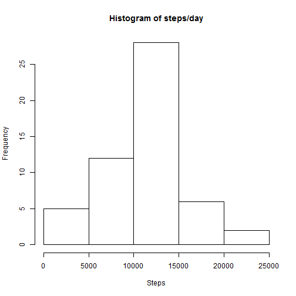
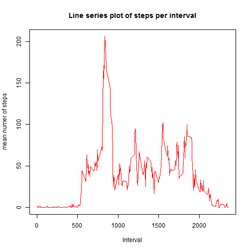
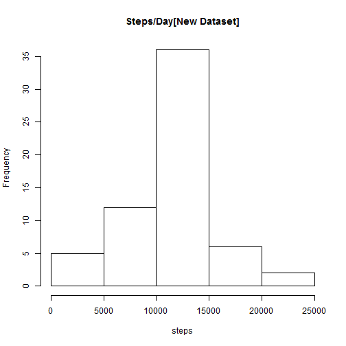
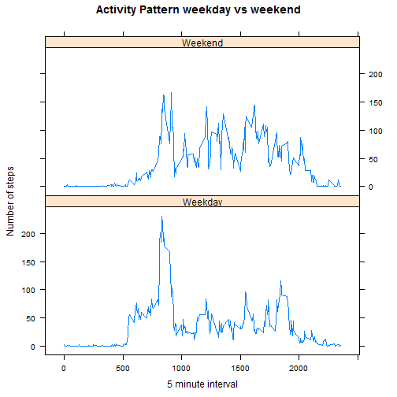

This document includes both the code and textual explanation about the analyses done. It's a first step towards literate statistical programming.
The document attempts to answer questions posed in "PEER ASSESSMENT 1" on the Coursera Reproducible Research course.


### Loading the data

```r
if(!file.exists("rep-data.activity.zip"))
{
  if(!file.exists("activity.csv"))
  {
    download.file("https://d396qusza40orc.cloudfront.net/repdata%2Fdata%2Factivity.zip","repdata-activity.zip",method="curl")
    unzip("rep-data.activity.zip")
  }
}else 
{
  if(!file.exists("activity.csv"))
  {
    unzip("rep-data.activity.zip")
  }
}
data<-read.csv("activity.csv")
```
The above code is used to


* Check for the presence of downloaded zip file

* Check for csv file

* Download and unzip file if applicable

### What is mean total number of steps taken per day?


```r
group<-aggregate(data$steps,list(data$date),sum)
names(group)<-c("Date","Steps")
mean(group$Steps,na.rm=TRUE)
```

```
## [1] 10766.19
```

```r
median(group$Steps,na.rm=TRUE)
```

```
## [1] 10765
```

```r
hist(group$Steps,main="Histogram of steps/day",xlab="Steps")
```

 

### What is the average daily activity pattern?
#### Which 5-minute interval, on average across all the days in the dataset, contains the maximum number of steps?

```r
group2<-aggregate(data$steps,list(data$interval),mean,na.rm=TRUE)
plot(group2[,1],group2[,2], type="l",main="Line series plot of steps per interval",xlab="Interval",ylab="mean numer of steps",col="red")
```

 

```r
group2[order(group2[,2],decreasing=T)[1],1]
```

```
## [1] 835
```
We can see that the 835th interval has the maximum value.
### Imputing missing values
#### Calculate and report the total number of missing values in the dataset?
The missing values in the dataset are imputed by filling it in with the mean value for that interval.
The mean and median for the new, filled in dataset are given as well.

```r
table(complete.cases(data)) ##Shows complete cases as "TRUE", incomplete as "FALSE"
```

```
## 
## FALSE  TRUE 
##  2304 15264
```

```r
datafull<-data

for (i in 1:nrow(datafull))
{
  if(is.na(datafull[i,1]))
  {
    x<-match(datafull[i,3],group2[,1])
    datafull[i,1]<-group2[x,2]
    
  }
}
table(complete.cases(datafull))
```

```
## 
##  TRUE 
## 17568
```

```r
group3<-aggregate(datafull$steps,list(datafull$date),sum)
hist(group3[,2],main="Steps/Day[New Dataset]",xlab="steps")
```

 

```r
group5<-aggregate(datafull$steps,list(datafull$date),sum)
mean(group5[,2])
```

```
## [1] 10766.19
```

```r
median(group5[,2])
```

```
## [1] 10766.19
```
After imputing the values the mean stays the same, but the median seems to have increased slightly.
Comparing the the two histograms we made, the total number of steps after imputing tends to be more central and the graph looks slightly more uniform than before

### Are there differences in activity patterns between weekdays and weekends?
#### Create a new factor variable in the dataset with two levels - "weekday" and "weekend" indicating whether a given date is a weekday or weekend day.

```r
require("lattice")
datafull$weekday<-0
datafull$date<-as.Date(as.character(datafull$date))
datafull[weekdays(datafull$date) %in% c("Sunday","Saturday"),4]<-"Weekend"
datafull[datafull$weekday==0,4]<-"Weekday"

group4<-aggregate(steps~interval+weekday,datafull,mean)

xyplot(steps~interval|weekday,group4,type='l',layout=c(1,2),xlab="5 minute interval",ylab="Number of steps",main="Activity Pattern weekday vs weekend")
```

 
The lines for weekdays and weekends look similar, the points in the interval which correspond to office hours seem to have more activity on the weekend than on weekdays, which might be an indiacation of a desk job, in my opinion.


